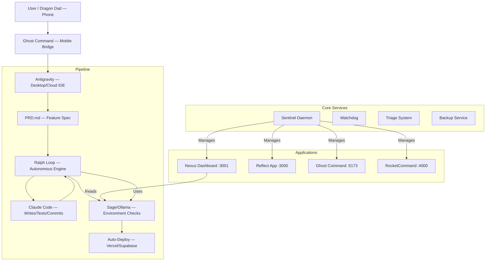

# Matrix Architecture

> Runtime authority update: use `docs/CANONICAL_RUNTIME.md` as the source of truth for current orchestration, health, and recovery paths.

## System Overview

The Matrix follows a "Monorepo-like" structure where multiple applications share a common core of services and utilities, driven by an autonomous **Phone → Ship** development pipeline.



## The Pipeline (Phone → Ship)

```
[You on Phone] → describe feature in plain language
    ↓
[Ghost Command / Antigravity Phone Chat] → sends to desktop
    ↓
[Antigravity + Gemini] → turns description into PRD.md
    ↓
[Ralph Loop starts] → feeds PRD tasks one at a time
    ↓
[Claude Code iterates] → writes code → runs tests → commits
    ↓
[Ralph loops to next task] → until <promise>COMPLETE</promise>
    ↓
[Sage/Ollama validates] → deps, ports, logs, builds
    ↓
[Auto-deploy] → Vercel / Supabase / Cloud Run
```

See `docs/PIPELINE.md` for full pipeline documentation.

## Component Roles

| Component | Role | Location |
|-----------|------|----------|
| **Antigravity** | Primary build environment (VS Code fork) | Desktop / Codespaces |
| **Ralph Loop** | "Don't stop until it's done" task engine | `core/sage/ralph-core.mjs` |
| **Sage / Ollama** | Local LLM — zero-credit env checks | `core/sage/engine.mjs` |
| **Claude Code** | The agent Ralph loops — writes actual code | Antigravity built-in |
| **Sentinel** | Service lifecycle manager | `core/sentinel.cjs` |
| **Watchdog** | Health monitoring | `core/watchdog.cjs` |

## Detailed Design

### Core Services
- **Language**: Node.js (CJS for services, ESM for Sage/Ralph).
- **Communication**: IPC / File-based signals (ghost_bridge via Supabase).
- **State**: Local JSON files (persistence) + Supabase (cloud sync).
- **AI Engine**: Sage → Ollama (local, localhost:11434) for cheap checks.

### Applications
- **Framework**: Next.js 16 (App Router).
- **Styling**: Tailwind CSS + Framer Motion.
- **State Management**: React Context + LocalStorage + Supabase.

### Apps

| App | Port | Purpose |
|-----|------|---------|
| Reflect | 3000 | User-facing journaling & reflection app |
| Nexus | 3001 | Central dashboard & command center |
| Ghost Command | 5173 | Mobile-first tactical remote |
| RocketCommand | 4000 | Operator hub — service management & remote ops |

## Data Flow

1. **Telemetry**: Apps push events to `core/analytics.cjs` via API routes.
2. **Health**: `triage.cjs` + `watchdog.cjs` scan codebases and monitor ports.
3. **Environment**: `SageEnvironment` validates deps, builds, ports, logs.
4. **Deployment**: Auto-deploy on Ralph `COMPLETE` signal.
5. **PRD Tracking**: `docs/prd/` contains feature specs, `progress/` tracks iterations.

## Directory Structure

```
g:\matrix
├── apps/                    # Next.js Applications
│   ├── nexus               # Dashboard & Command Center (:3001)
│   ├── reflect             # Journaling & Reflection (:3000)
│   ├── ghost-command       # Mobile Tactical Remote (:5173)
│   ├── rocket-command      # Operator Hub (:4000)
│   └── ralph               # Autonomous Loop CLI
├── core/                    # Node.js Services
│   ├── sage/               # AI Engine
│   │   ├── engine.mjs      # Sage LLM client + SageEnvironment
│   │   ├── ralph-core.mjs  # Ralph Loop engine (PRD-driven)
│   │   └── check.mjs       # Quick environment health scan
│   ├── sentinel.cjs        # Service lifecycle daemon
│   └── watchdog.cjs        # Port health monitor
├── docs/                    # Documentation
│   ├── PIPELINE.md         # Phone→Ship pipeline guide
│   ├── ARCHITECTURE.md     # This file
│   ├── templates/          # PRD & Progress templates
│   └── prd/                # Active PRDs & progress tracking
├── launchers/               # Start/stop/build scripts
└── MASTER/                  # Master prompts & direction
```
